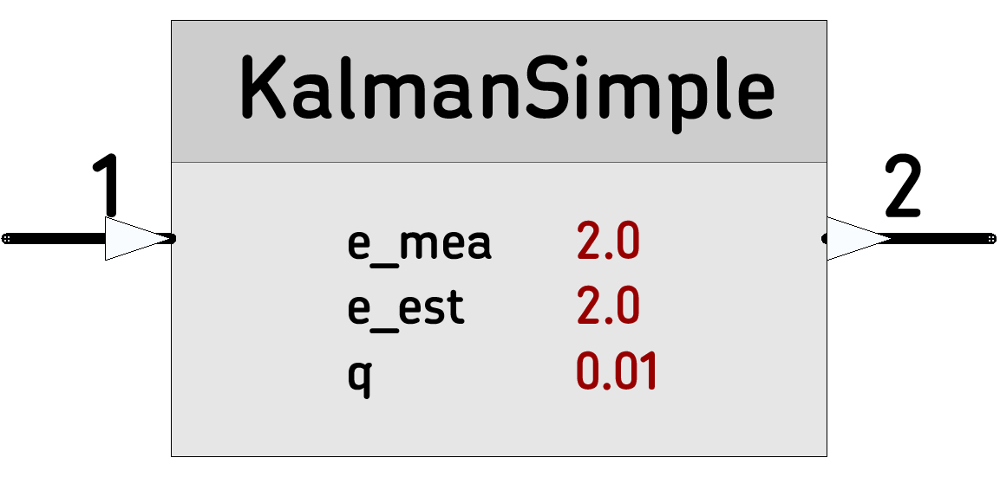

# [KalmanSimple](https://github.com/nBlocksStudioNodes/nblocks_kalmansimple) 

Cleans noisy sensor data

----

----

 *  Category: Math
 *  HAL: No Hardware dependencies
 *  Status:  Node Defined, remote repo created, Node Code in progress 
 *  Author: Nikolaos Chalikias

## Implementation details

Based on Denys Sene Arduino Library [SimpleKalmanFilter](https://www.arduino.cc/reference/en/libraries/simplekalmanfilter/) and mbed ported example [42_BasicKalmanFilterExample](https://github.com/The-101-project/42_BasicKalmanFilterExample)

## Inputs/Outputs
 *  float: Input signal, single value, triggers proccessing
 *  float: Output signal, single value

## Parameters 
*  float: e_mea: Measurement Uncertainty 
*  float: e_est: Estimation Uncertainty 
*  float: q: Process Noise

## Example:
[Ticker]-->[ADC]-->[KalmanBasic]-->[StringSerial]

